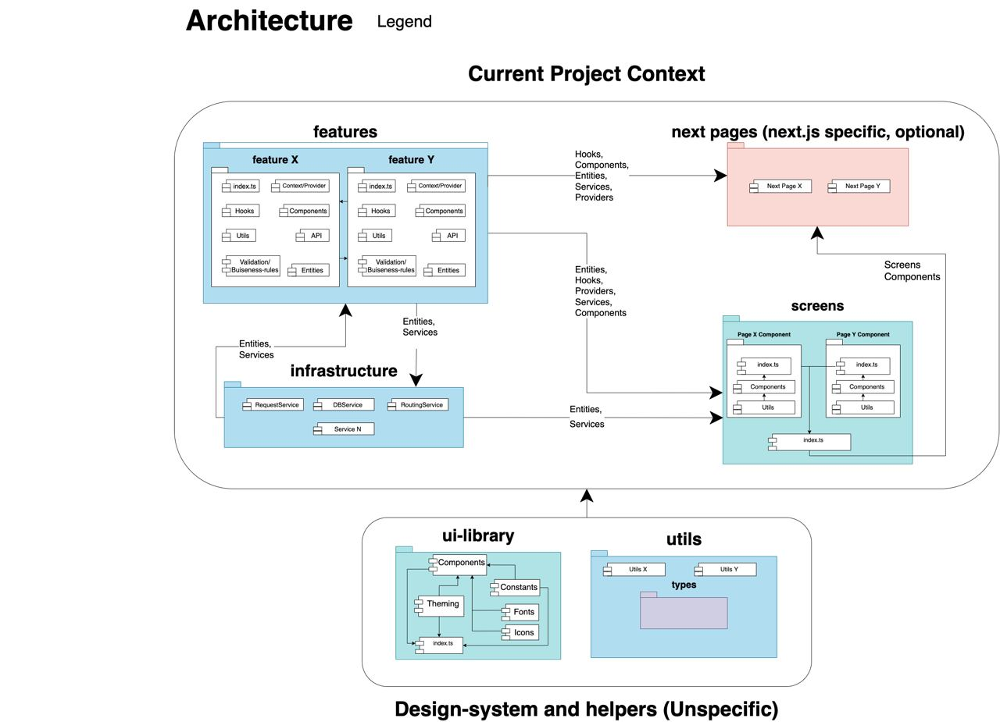
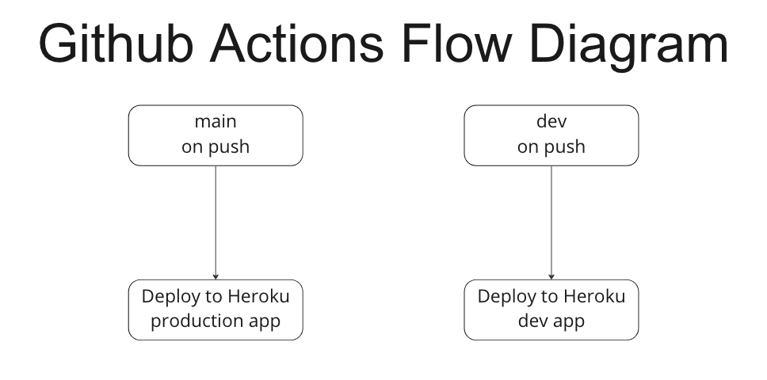

# Репозиторий проекта "Динозавры в IT!"

# Оглавление
- [Минимальные требования](#Минимальные-требования)
- [Ссылки на проект в онлайне](#Ссылки-на-проект-в-онлайне)
- [Установка проекта](#Установка-проекта)
- [Процесс разработки](#Процесс-разработки)
- [Структура проекта](#Структура-проекта)
- [Используемые технологии](#Используемые-технологии)
- [Тестирование](#Тестирование)
- [CI/CD](#CI/CD)
- [Деплой](#Деплой)
- [Релизы](#Релизы)

## Минимальные требования
* Node.js >= 16.0.0
* [Yarn](https://yarnpkg.com/) >= 1.22.0

## Ссылки на проект в онлайне
* [Продакшн](https://bootcamp-team2.herokuapp.com/)
* [Dev/Разработка](https://bootcamp-team2-dev.herokuapp.com/)

## Установка проекта
Мы используем `yarn` в качестве основного менеджера пакетов. Для установки зависимостей воспользуйтесь следующей командой:

```
yarn install
```

И наконец запустите `dev` сервер командой

```
yarn dev
```

Открываем страницу `http://localhost:3000/` и вуаля! Можно приступать к работе! 🎉

## Процесс разработки
Мы работаем по классическому Git flow. Есть ветка `main` (код из main находится на продакшн), и есть ветка `dev`, где ведется основная разработка, и от нее делаются фиче-ветки.

Также есть релизная ветка. Это ветка, которая создается от ветки dev и потом  вливается в master и dev. Таким образом на продакшн поставляется новый код.

⚠️ **Важно! Пуш напрямую в ветку main (в продакшен) запрещен. Для релиза приложения в продакшн создавайте отдельную release ветку от dev и после ревью сливайте ее в main (См. [Релизы](#релизы))**

⚠️ Важно! Все фиче-ветки должны быть созданы от ветки dev, а не от main.

## Архитектура проекта
Мы используем `Feature Based` архетиктуру, где каждая фича находится в своей папке. Внутри папки фичи находятся файлы, относящиеся к этой фиче. Например, `/users/users.entity.ts` - содержит описание типов сущности пользователя, `users/users.service.ts` содержит код относящийся к API пользователей, а `users/components/` содержит компоненты, относящиеся к к пользователям.

#### Примерную структуру проекта увидеть на данной диаграмме:

<br />



## Используемые технологии 
* [TypeScript](https://www.typescriptlang.org/) - язык программирования
* [React](https://reactjs.org/) - библиотека для создания пользовательского интерфейса
* [MUI](https://mui.com/) - библиотека компонентов
* [React Query](https://react-query.tanstack.com/) - библиотека для управления серверным состоянием
* [Zustand](https://zustand-demo.pmnd.rs/) - библиотека для управления клиентским состоянием
* [React Hook Form](https://react-hook-form.com/) - библиотека для работы с формами
* [Axios](https://axios-http.com/) - библиотека для работы с сетью
* [React Router](https://reactrouter.com/) - библиотека для работы с маршрутизацией
* [Dayjs](https://day.js.org/) - библиотека для работы с датами

### Общая инфраструктура
* [ESLint](https://eslint.org/) - линтер для статического анализа кода
* [Prettier](https://prettier.io/) - форматтер для единого стиля кода
* [Husky](https://typicode.github.io/husky/#/) - библиотека для работы с git hooks
* [MSW](https://mswjs.io/) - библиотека для работы с моковыми API
* [Faker.js](https://fakerjs.dev/) - библиотека для генерации фейковых данных
* [Github Actions](https://github.com/features/actions) - CI/CD
* [Heroku](https://www.heroku.com/) - хостинг
* [Docker](https://www.docker.com/) - контейнеризация
* [Nginx](https://www.nginx.com/) - веб-сервер для отдачи статики

## Онлайн мониторинг
TODO: заюзать [Sentry](https://sentry.io/welcome/) для мониторинга ошибок?

## Тестирование
TODO: Добавить описание тестирования
TODO: Написать про mock API и MSW

## Mock API
Для быстрого прототипирования некоторых фич мы мокаем API с помощью библиотеки [MSW](https://mswjs.io/). Это позволяет нам быстро разрабатывать фронтенд, пока на бэкенде ребята пилят API. После того, как API готово, мы просто удаляем мок эндпойнты и подключаемся к реальному API. Примеры моков можно посмотреть в папке `src/features/courses/mocks/`. Папка содержит файлы с моками для каждого запроса, а также сгенеррированные данные для моков. Для генерации данных мы используем библиотеку [Faker.js](https://fakerjs.dev/)

Для того, чтобы моки конкретной фичи заработали, нужно поставить переменную окружения `VITE_ENABLE_API_MOCKING` в значение `true`, а также подключить нужные эндпойнты файле `src/infrastructure/mock-service-worker/browser.ts`. 


## CI/CD
Мы используем Github Actions для CI/CD. Все конфиги лежат в папке `.github/workflows/`. При пуше в main и dev ветки происходит деплой на соответствующие среды. Для деплоя используется [Heroku](https://heroku.com/). Об информации о деплое можно узнать в разделе [Деплой](#Деплой).

#### Диграмма CI/CD 

<br />



Актуальная версия диаграммы также доступна на нашей [Miro доске](https://miro.com/app/board/uXjVPUm63ag=/?moveToWidget=3458764536050203849&cot=14)

## Деплой
Деплой происходит автоматически при пуше в main и dev ветки. Для деплоя используется [Heroku](https://heroku.com/), который в свою очередь собирает Docker контейнер описанный в Dockerfile. 

Docker билдит проект с помощью `vite build`, а также поднимает nginx сервер, который отдает сбилженную статику.

## Релизы

Для релиза приложения в продакшн среду нужно создать релиз ветку, например release-16.11.22.1. После этого нужно создать PR из релизной ветки в main и описать изменения в [CHANGELOG.md](/CHANGELOG.md). После мерджа PR в main ветку, произойдет деплой на продакшн. 

